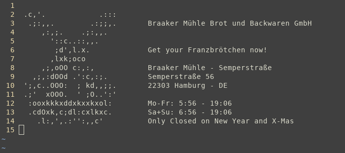

**Sponsored by:**



# rebuilderd-debian-buildinfo-crawler

This program parses the `Packages.xz` debian package index, attempts to discover the right buildinfo file from <https://buildinfos.debian.net> and prints them in a format that can be understood by [rebuilderd](https://github.com/kpcyrd/rebuilderd):

```json
{
  "name": "0ad-data",
  "version": "0.0.25b-1",
  "distro": "debian",
  "suite": "main",
  "architecture": "all",
  "input_url": "https://buildinfos.debian.net/buildinfo-pool/0/0ad-data/0ad-data_0.0.25b-1_all.buildinfo",
  "artifacts": [
    {
      "name": "0ad-data",
      "version": "0.0.25b-1",
      "url": "https://deb.debian.org/debian/pool/main/0/0ad-data/0ad-data_0.0.25b-1_all.deb"
    },
    {
      "name": "0ad-data-common",
      "version": "0.0.25b-1",
      "url": "https://deb.debian.org/debian/pool/main/0/0ad-data/0ad-data-common_0.0.25b-1_all.deb"
    }
  ]
},
```

Rebuilderd can then pass the buildinfo files to [debrebuild.py](rebuilderd-debian-buildinfo-crawler) and compare the build outputs to the files distributed by debian.

This implementation explicitly attempts to work around the build-version/binnmu-version problem described in my blog post [Reproducible Builds: Debian and the case of the missing version string](https://vulns.xyz/2022/01/debian-missing-version-string/). This project should be considered a workaround.

## Usage

```sh
# Generate the json
cargo run --release -- --db foo.db --packages-db http://deb.debian.org/debian/dists/sid/main/binary-amd64/Packages.xz --source http://deb.debian.org/debian --distro debian --suite main --release sid --arch amd64 > import.json
# Import the json into rebuilderd (requires rebuilderd/rebuildctl to be setup and configured)
rebuildctl pkgs sync-stdin debian main < import.json
```

## FAQ

### The initial import takes very long

Yes, that's a limitation of this workaround. The second run is faster. 🤞

### What's `https://buildinfos.debian.net/missing-buildinfo/`?

If debian distributes a binary package (`.deb`) that we couldn't locate a buildinfo file for, we still output this build group but use a dummy link. Rebuilderd is going to fail to download this buildinfo file and mark the corresponding .deb's as unreproducible.

To show the list of packages in debian unstable with missing buildinfo files, use this command:

```sh
# Check the usage section how import.json is generated
grep missing-buildinfo import.json
```

### I think this is cool work, how can I get more of this?

Follow me on [Twitter](https://twitter.com/kpcyrd) and consider contributing to my next sponsorhip goal on [Github Sponsors](https://github.com/sponsors/kpcyrd), thanks!

## License

GPLv3+
